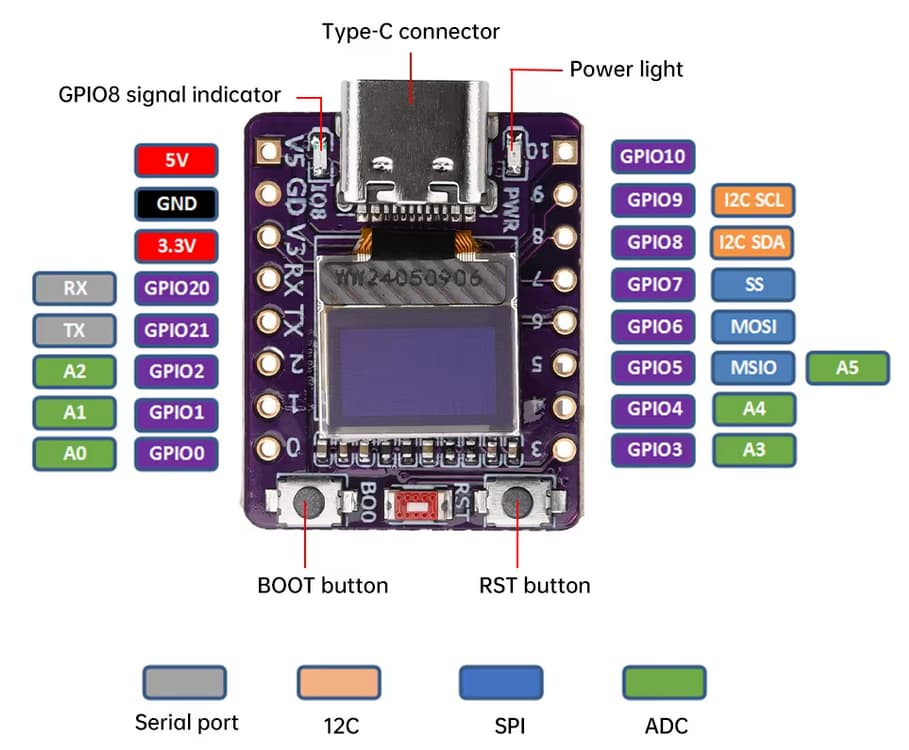
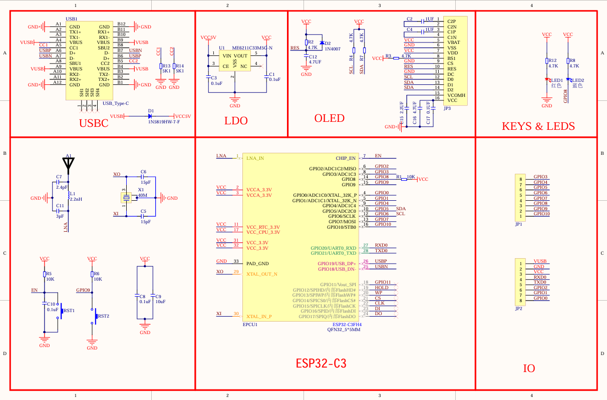
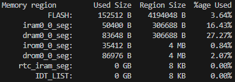
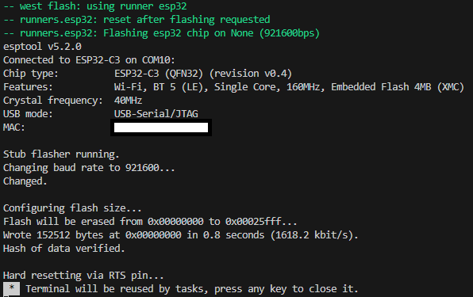

# ESP32-C3 SuperMini Weather Station | Zephyr RTOS

### High-performance firmware for a compact weather station, focused on modularity, thread safety, and peripheral efficiency using Zephyr RTOS v4.3.0.

---

## Software Architecture (Modular Design)
The project is decoupled into five specialized modules to ensure scalability and clean code:

* **Main Orchestrator:** Coordinates system boot, NVS persistence, and global timing via Kernel Timers.
* **Display & Sensor Task (Priority 7):** Independent thread for **SSD1306** OLED rendering and **AHT10** data processing.
* **I2C Bus Manager:** Centralizes hardware access using a **Mutex** (`i2c_mutex`) to prevent bus collisions between the display and sensor.
* **PWM & Timers:** Manages high-frequency signal generation and asynchronous UI interrupts (GPIO9-INT).
* **NVS Storage:** Handles non-volatile data, including a circular boot counter (1-5) to monitor hardware stability.

---

## Key Features
- **Concurrent Execution:** Independent loops for UI and logic, synchronized via Binary Semaphores (`sem_ui_refresh`, `sem_main_tick`).
- **I2C Optimization:** Smart Mutex management that releases the bus during the AHT10 80ms conversion time, keeping the system responsive.
- **Persistence:** Flash-based boot tracking using the Zephyr NVS (Non-Volatile Storage) file system.
- **Visual Heartbeat:** Atomic-based LED toggling (GPIO8) providing real-time "system liveness" diagnostics.
- **Robustness:** Integrated **Watchdog (WDT)** with a 3s timeout for automatic recovery in case of thread deadlock.

---

## Hardware & Peripherals (DeviceTree)
- **OLED Display:** 0.42" SSD1306 configured via `Character Framebuffer (CFB)` with a specialized RC reset stabilization delay (1000ms).
- **Dual-Channel PWM (LEDC):**
    - **GPIO2:** 20kHz @ 10% Duty Cycle (Timer 0).
    - **GPIO3:** 10kHz @ 20% Duty Cycle (Timer 1).
- **I2C0:** Standard mode (100kHz) with dedicated Pinctrl mapping for the ESP32-C3 SuperMini pinout.
- **AHT10 Sensor:** Raw I2C implementation with 20-bit data shifting for precise Celsius and Humidity readings.

---

## Technical Corrections (Zephyr 4.x)
- **Driver Compatibility:** Updated `compatible` string to `"solomon,ssd1306fb"` to match the latest Zephyr 4.x driver requirements.
- **Pinctrl Integration:** Full pin mapping via `pinctrl` nodes for the ESP32-C3 target.

## Image

