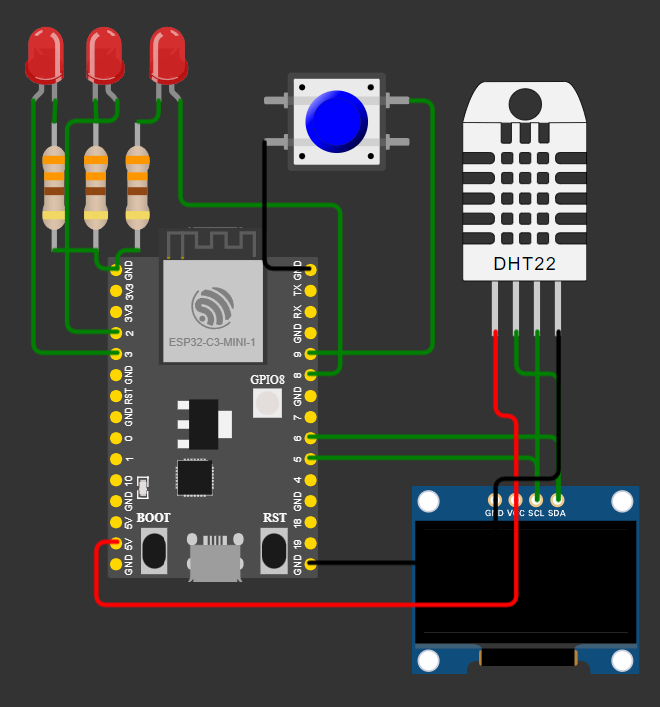

# Zephyr with ESP32C3 supermini
## Implements a weather station with multithreading and PWM control.

### Firmware for the SuperMini station, focusing on security, concurrency, and efficiency of peripherals using Zephyr RTOS 4.3.0.

### Software Architecture:
- **Display Task (Priority 7):** Independent loop for 0.42inch OLED rendering
SSD1306 via Character Framebuffer (CFB), synchronized by semaphore `(sem_ui_refresh)`.
- **Sensor Management:** Reading from **AHT10** via I2C raw, using hardware timers
and blocking semaphores to avoid `msleep()` and release the CPU during conversion.
- **Heartbeat & UI:** Implementation of LED toggling via interrupt (GPIO9-INT)
using atomic operations to ensure integrity between contexts (ISR vs Main).

### Peripherals and Hardware (DeviceTree):
- **I2C0:** Configured at 100kHz for **SSD1306** and **AHT10** with overlay support.
- **PWM:** Configuration of two independent channels (LEDC) with distinct timers:
   * **GPIO2:** 20kHz @ 10% Duty Cycle.
   * **GPIO3:** 10kHz @ 20% Duty Cycle.
- **Watchdog (WDT):** Activation of the system timer with a 3s timeout for automatic recovery in case of thread failure.

### Hardware Corrections:
- **Driver Compatibility:** Adjustment of `'compatible'` to `"solomon,ssd1306fb"` according to Zephyr 4.x requirements.
- **Pinctrl:** Pin mapping via `Pinctrl` for the ESP32-C3 SuperMini format.

## Image
